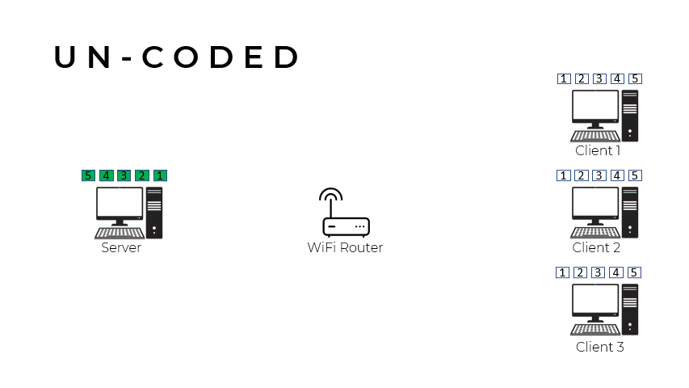
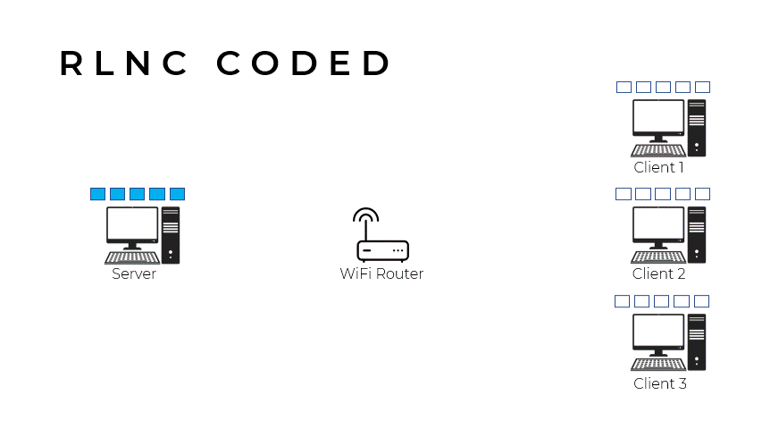
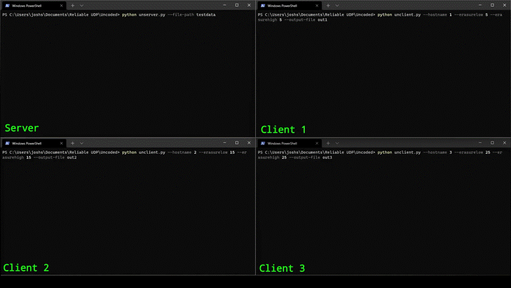
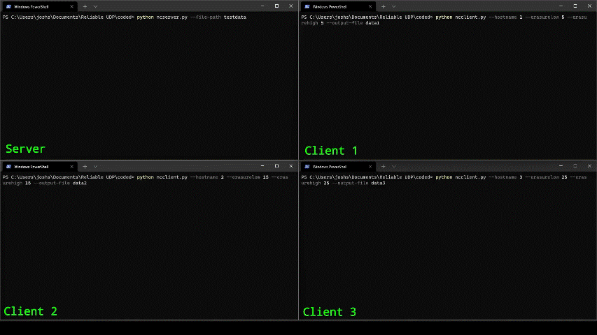

# Smart UDP: A network coding testbed
A custom, reliable UDP protocol written in Python to enable the transfer of large data files via WiFi multi-cast with the aim of testing the network utilisation efficiency of network coding algorithms.

## Introduction

## Background

