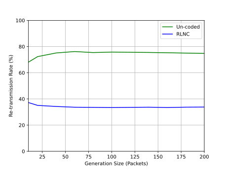
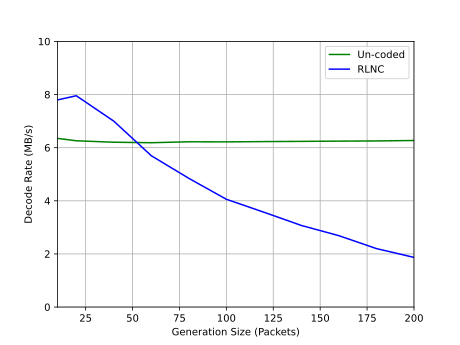
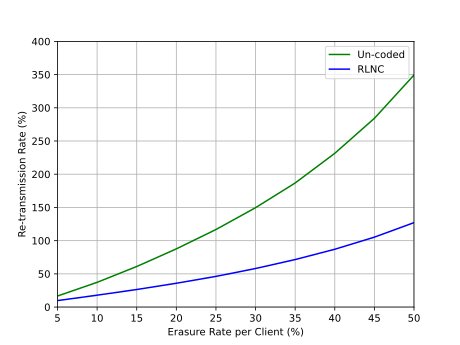
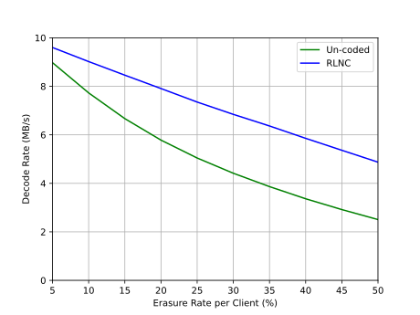
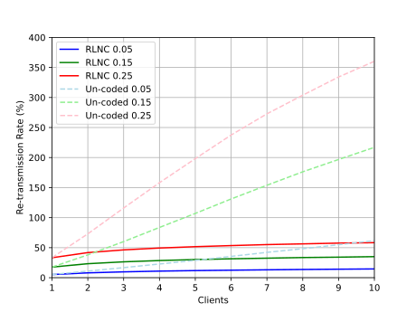
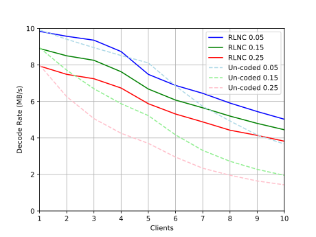

# Smart UDP: A network coding testbed
A custom, reliable UDP protocol written in Python to enable the transfer of large data files via WiFi multi-cast with the aim of testing the network utilisation efficiency of network coding algorithms.

The network coding version of this protocol uses Steinwurf's network coding library called Kodo. To make use of the network coded version, a research license must be obtained at:
https://www.steinwurf.com/license

Installation of the Kodo Python bindings are also required, and instructions can be found within the Kodo Python documentation:
https://kodo-python.steinwurf.com/17.0.1/

## Introduction

This testbed was constructed as a result of research conducted into the advantages of utilising network coding in a WiFi multi-cast scenario as my Ba. Electrical Engineering thesis.

## Background

### Network Coding
Network coding theory shows that the number of transmissions required to send data through a network can be reduced when packets are coded, compared to the traditional un-coded case. 

Random Linear Network Coding (RLNC) was chosen as the algorithm to be used to verify this testbed and involves encoding generations (fixed number) of packets via matrix multiplication with a randomly generated coefficient matrix. Decoding is then performed by matrix inversion of the coefficient matrix at the client.

When packets are coded, all unique packets sent through the network are relevant to all clients that require packets. This is where efficieny gains are made over un-coded packets, which are only relevant to clients that need them specifically. When packets are lost (erasure), a client in a coded network can use any new, unique packet instead of having to wait for the specific one it needs. This is best demonstrated in the animations below:

In this basic scenario with a probability of packet loss per client of 20%, the coded version re-transmitted 66% less packets than the un-coded version.

### Wireless Networks

When employed in a wireless network, there is a potential for network utilisation efficiency to be dramatically increased by taking advantage of WiFi multi-cast. Despite this theoretical benefit, current 802.11 standards do not favour high through-put multi-cast traffic and in fact send multi-cast traffic at the lowest rates possible to give all stations the best chance of receiving data. "Multicast Considerations over IEEE 802 Wireless Media" (RFC 9119) seeks to solve these problems, however this is ongoing project.

This testbed was designed with the intention of testing on a real network, however the issues raised in RFC 9119 precluded that. Verification was instead performed on single PC by running a server and multiple instances of clients from different terminal sessions. Multi-cast was confirmed via WireShark packet capture.

## System Model & Usage

The testbed was built in two parts - classes for server and client objects that implement all required methods to function, and a flow control script for each to manage the reliable transmission of large files across the network from a single server to multiple clients.

Two versions were produced: un-coded and RLNC block coded, with network coding performed by the Kodo network coding library.

In both cases, clients must be started before the server and will wait and listen indefinitely for an engineering packet from a server.

### Client:

Clients can be initialised with no arguments and will run with a default settings as seen in the argument defaults.

If running on a single PC, hostname should be manually set at execution (--hostname) to a unique value for each client, or else all clients will try to use the same hostname.

Setting the location for the received file can be done with (--output-file).

Simulated erasure is done with (--erasurelow) and (--erasurehigh). If these are set the same, the erasure probability will that value. If a range is given, the probability will be randomly selected within that range.

### Server:

A server requires a file path to the desired file to transmit (--file-path), or else it will send a copy of the server script as default.

Generation size can also be set with (--gen-size)

### Coded:

For the coded testbed to work, the Kodo library must be compiled and either exist in the same directory, or be added to the system PATH.

## Verification

As previously mentioned, testing was done on a single PC and demonstrations of both un-coded and RLNC can be seen below:

### Un-coded

### RLNC

These demonstrations have three clients with erasure probabilities of 0.05, 0.15 and 0.25, and show the expected decrease in re-transmissions required for successful transfer.

## Results

Results for various tests conducted are shown below and all show increases in network utilisation performance for the RLNC case.

### Generation size test with three clients (0.05, 0.15, 0.25 erasure probability):
 

### Erasure rate test with three clients of increasing erasure probability:
 

### Scalability test with increasing number of clients at erasure probabilities of 0.05, 0.15 & 0.25:
 

